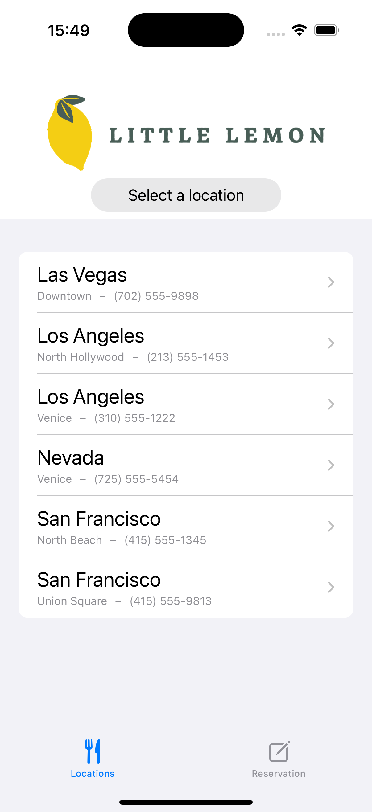
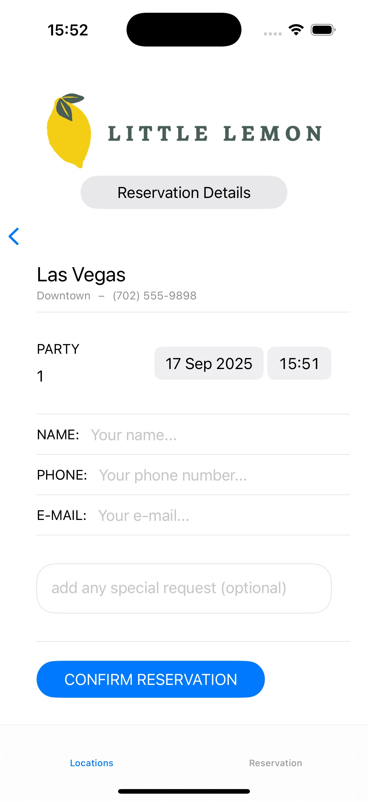
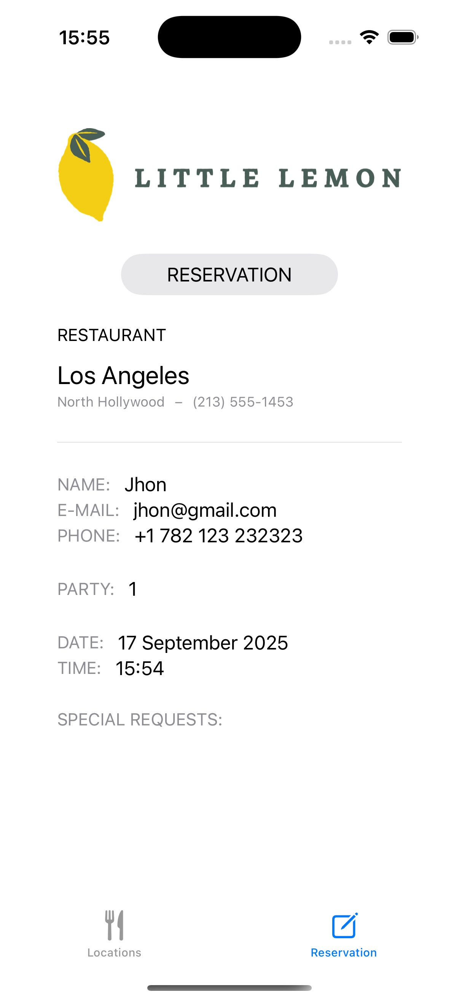

# Little Lemon Reservation (SwiftUI)

Small practice app from **Meta iOS – Course 3 (SwiftUI UI basics)**.

## What it does
- Simple SwiftUI screens (e.g., menu / reservation form)
- Basic navigation with `NavigationStack`
- Minimal state with `@State`

## Requirements
- Xcode 15+ · iOS 17+
- Swift 5.9+

## Run
1. Clone this repo  
2. Open `LittleLemonReservation.xcodeproj` (or `.xcworkspace` if you use Pods)  
3. Choose an iPhone Simulator → **Run** (⌘R)

## Screenshots

  
  
  

## Notes
If Xcode Previews complain about **Development Assets**, either leave **Build Settings → Development Assets** empty, or add a folder reference named `Preview Content` with `Preview Assets.xcassets`.

---

> If your target/repo is named `LitleLemonReservation` (single *t*), adjust the file names and paths above accordingly.
